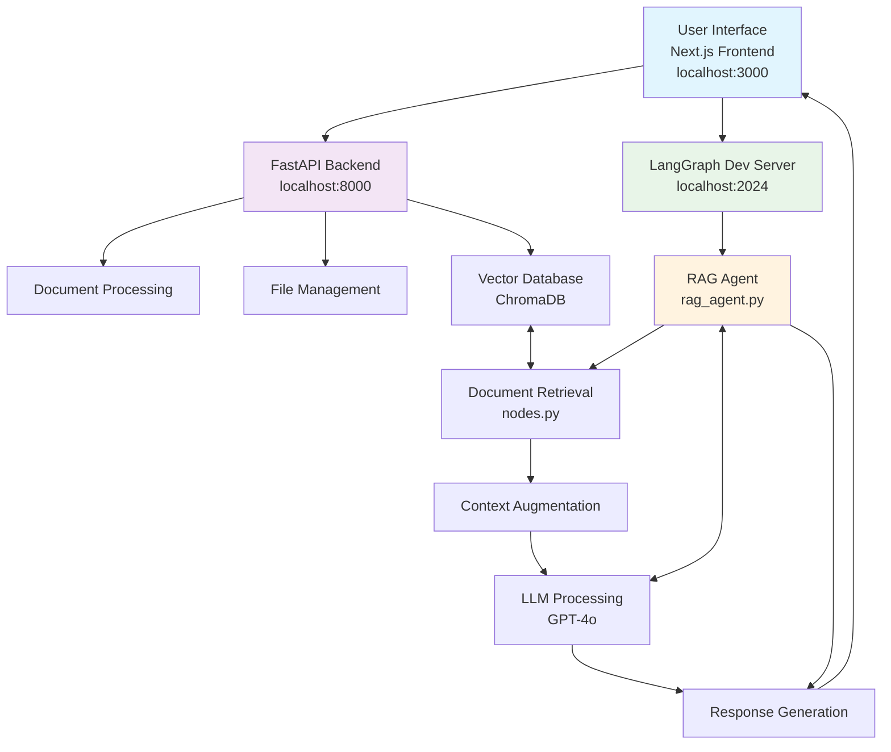
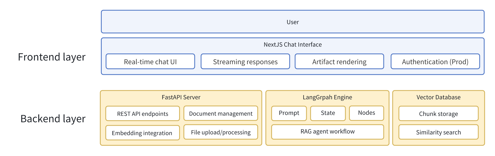

# Agent RAG Chat

Agent Chat UI is a comprehensive full-stack application that enables chatting with LangGraph AI agents through an intuitive chat interface.

## Repository Structure

### 1. Frontend (Next.js Chat UI)

The frontend is built with Next.js and provides a modern chat interface for interacting with AI agents. Based on the [official LangChain Agent Chat UI](https://github.com/langchain-ai/agent-chat-ui.git), it offers:

- Real-time chat interface with streaming responses
- Artifact rendering in side panels
- Production-ready authentication options
- Environment-based configuration

### 2. Web Server (FastAPI Backend)

Located in the `/backend` directory, this FastAPI server provides:

- RESTful API endpoints for document processing
- File upload and management capabilities
- Integration layer between frontend and AI backend
- Built with FastAPI, supporting async operations

**Key Dependencies:**
- FastAPI with Uvicorn
- LangChain ecosystem integration
- Document processing (PDF, DOCX, TXT, MD)
- Vector database support (ChromaDB)

### 3. LangGraph AI Backend

Located in the `/langgraph` directory, this contains the core AI logic:

- RAG (Retrieval-Augmented Generation) agent implementation
- LangGraph workflow definitions
- Custom nodes and state management
- Configurable prompts and utilities

**Key Components:**
- `rag_agent.py` - Main graph definition
- `nodes.py` - Individual workflow nodes
- `state.py` - State management
- `utils.py` - Helper functions
- `prompt.py` - Prompt templates


## Setup

### Prerequisites

- Node.js 18+ and pnpm
- Python 3.8+
- Git

### 1. Clone and Initial Setup

```bash
git clone https://github.com/ZhihaoZhang97/rag-agent
cd rag-agent
```

### 2. Frontend Setup

Install frontend dependencies:

```bash
pnpm install
```

### 3. Backend Setup

Install Python backend dependencies:

```bash
cd backend
pip install -r requirements.txt
cd ..
```

### 4. LangGraph AI Backend Setup

Install LangGraph dependencies:

```bash
cd langgraph
pip install -r ../backend/requirements.txt  # Uses same requirements
cd ..
```

### 5. Environment Configuration

Copy the example environment file and configure:

```bash
cp .env.example .env
# Edit .env with your configuration
```

### 6. Start All Services

**Terminal 1 - Frontend (Port 3000):**
```bash
pnpm dev
```

**Terminal 2 - FastAPI Backend (Port 8000):**
```bash
cd backend
python run.py
```

**Terminal 3 - LangGraph Dev Server (Port 2024):**
```bash
cd langgraph
langgraph dev
```

### 7. Access the Application

- Frontend: `http://localhost:3000`
- FastAPI Backend: `http://localhost:8000`
- LangGraph API: `http://localhost:2024`

## Usage

Once the app is running (or if using the deployed site), you'll be prompted to enter:

- **Deployment URL**: The URL of the LangGraph server you want to chat with. This can be a production or development URL.
- **Assistant/Graph ID**: The name of the graph, or ID of the assistant to use when fetching, and submitting runs via the chat interface.
- **LangSmith API Key**: (only required for connecting to deployed LangGraph servers) Your LangSmith API key to use when authenticating requests sent to LangGraph servers.

After entering these values, click `Continue`. You'll then be redirected to a chat interface where you can start chatting with your LangGraph server.

## Environment Variables

You can bypass the initial setup form by setting the following environment variables:

```bash
NEXT_PUBLIC_API_URL=http://localhost:2024
NEXT_PUBLIC_ASSISTANT_ID=rag_agent
```

## System Architecture

### Pipeline Flow



### System Components Diagram



### Data Flow Pipeline

1. **User Input** → Frontend receives user message
2. **Request Routing** → Frontend routes to appropriate backend service
3. **Document Processing** → FastAPI processes and stores documents in vector DB
4. **Context Retrieval** → LangGraph queries vector DB for relevant context
5. **Prompt Augmentation** → RAG agent combines user query with retrieved context
6. **LLM Processing** → External LLM (OpenAI/Anthropic) generates response
7. **Response Streaming** → Real-time response streaming back to frontend
8. **UI Updates** → Frontend renders response with artifacts if applicable
